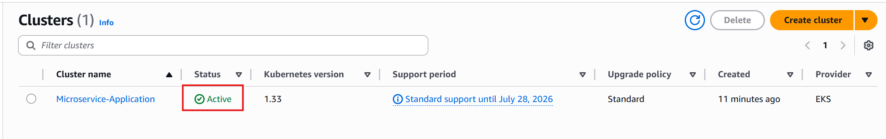

# Devops Project: video-converter
Converting mp4 videos to mp3 in a microservices architecture.

## Architecture

<p align="center">
  
  </p>

## Deploying a Python-based Microservice Application on AWS EKS

### Introduction

This document provides a step-by-step guide for deploying a Python-based microservice application on AWS Elastic Kubernetes Service (EKS). The application comprises four major microservices: auth-server, converter-module, database-server (PostgreSQL and MongoDB), and notification-server.

### Prerequisites

On Windows, install prerequisites using [Helm](https://helm.sh/docs/intro/install/), [Python](https://www.python.org/downloads/), [AWS CLI](https://docs.aws.amazon.com/cli/latest/userguide/getting-started-install.html), [kubectl](https://kubernetes.io/docs/tasks/tools/), and set up [PostgreSQL](https://www.postgresql.org/download/) and [MongoDB](https://www.mongodb.com/try/download/community) by following their official instructions.


### Setup:

#### Cluster Creation


1. **Create eksCluster IAM Role**
   - Create a eks cluster Role with the below permissions.


- Please attach `AmazonEKS_CNI_Policy` explicitly if it is not attached by default

2. **Create Node eksNodeRole IAM Role**
    - Create a eks Node Role with the below permissions.
    - Please note that you do NOT need to configure any VPC CNI policy mentioned after step 5.e under Creating the Amazon EKS node IAM role
    - Simply attach the following policies to your role once you have created `AmazonEKS_CNI_Policy` , `AmazonEBSCSIDriverPolicy` , `AmazonEC2ContainerRegistryReadOnly`
     incase it is not attached by default.


- Please attach `AmazonEKS_CNI_Policy` explicitly if it is not attached by default


3. **Open EKS Dashboard:**
   - Navigate to the Amazon EKS service from the AWS Console dashboard.

4. **Create EKS Cluster:**
   - Click "Create cluster."
   - Choose a name for your cluster.
   - Configure networking settings (VPC, subnets).
   - Choose the `eksCluster` IAM role that was created above
   - Review and create the cluster.


5. **Cluster Creation:**
   - Wait for the cluster to provision, which may take several minutes.

6. **Cluster Ready:**
   - Once the cluster status shows as "Active," you can now create node groups.



#### Adding Inbound Rules in Security Group of Nodes

Once the EKS cluster is up, an EC2 instance will be created. Allow the necessary ports in the security group’s inbound rules to ensure proper communication between services.

**NOTE:** Ensure that all the required ports are open in the node security group.


#### Deploying your application on EKS Cluster

1. Clone the code from this repository:
   ```
   https://github.com/charan-kilana/End-to-End-Microservices-on-Amazon-EKS-with-RabbitMQ-Postgres-and-MongoDB.git
   ```
2. Configure AWS CLI::
   ```
   aws configure
   ```

2. Set the cluster context:
   ```
   aws eks update-kubeconfig --name <cluster_name> --region <aws_region>
   ```
Here my cluster name is: **Microservice-Application** and region is **us-east-1**.


### Commands

Here are some essential Kubernetes commands for managing your deployment:

Lets Start with deploying MongoDB, postgreSQL and then RabbitMQ

### MongoDB

To install MongoDB, set the database username and password in `values.yaml`, then navigate to the MongoDB Helm chart folder and run:

```
cd Helm_charts/MongoDB
helm install mongo .
```


Connect to the MongoDB instance using:

The username and password are `nasi` and `nasi1234` respectively. You can change them in the Helm Charts `values.yaml` file. You can check the EC2 IP in the AWS Console under the EC2 dashboard.


```
mongosh mongodb://<username>:<pwd>@<nodeip>:30005/mp3s?authSource=admin
```


### PostgreSQL

Set the database username and password in `values.yaml`. Install PostgreSQL from the PostgreSQL Helm chart folder and initialize it with the queries in `init.sql`. For PowerShell users:

```
cd ..
cd Postgres
helm install postgres .
```


The username and password are `nasi` and `cnd2023` respectively. You can change them in the Helm Charts `values.yaml` file. You can check the EC2 IP in the AWS Console under the EC2 dashboard.


```
psql 'postgres://<username>:<pwd>@<nodeip>:30003/authdb'
```


Connect to the Postgres database and copy all the queries from the "init.sql" file.


Exceute commands inside the **authdb**


### RabbitMQ

Deploy RabbitMQ by running:

```
helm install rabbitmq .
```


Ensure you have created two queues in RabbitMQ named `mp3` and `video`. To create queues, visit `<nodeIp>:30004>` and use default username `guest` and password `guest`


**NOTE:** Ensure that all the necessary ports are open in the node security group.

**Kubernetes mongo, postgres and rabbitmq resources**


### Apply the manifest file for each microservice:

- **Auth Service:**
  ```
  cd auth-service/manifest
  kubectl apply -f .
  ```

- **Gateway Service:**
  ```
  cd gateway-service/manifest
  kubectl apply -f .
  ```

- **Converter Service:**
  ```
  cd converter-service/manifest
  kubectl apply -f .
  ```

- **Notification Service:**
  ```
  cd notification-service/manifest
  kubectl apply -f .
  ```

### Application Validation

After deploying the microservices, verify the status of all components by running:

```
kubectl get all
```

### Notification Configuration


For configuring email notifications and two-factor authentication (2FA), follow these steps:

1. Go to your Gmail account and click on your profile.

2. Click on "Manage Your Google Account."

3. Navigate to the "Security" tab on the left side panel.

4. Enable "2-Step Verification."

5. Search for the application-specific passwords. You will find it in the settings.

6. Click on "Other" and provide your name.

7. Click on "Generate" and copy the generated password.

8. Paste this generated password in `notification-service/manifest/secret.yaml` along with your email.

Run the application through the following API calls:

# API Definition

- **Login Endpoint**
  ```http request
  POST http://nodeIP:30002/login
  ```

  ```console
  curl -X POST http://nodeIP:30002/login -u <email>:<password>
  ``` 
  Expected output: success!

- **Upload Endpoint**
  ```http request
  POST http://nodeIP:30002/upload
  ```

  ```console
   curl -X POST -F 'file=@./video.mp4' -H 'Authorization: Bearer <JWT Token>' http://nodeIP:30002/upload
  ``` 
  
  Check if you received the ID on your email.

- **Download Endpoint**
  ```http request
  GET http://nodeIP:30002/download?fid=<Generated file identifier>
  ```
  ```console
   curl --output video.mp3 -X GET -H 'Authorization: Bearer <JWT Token>' "http://nodeIP:30002/download?fid=<Generated fid>"
  ``` 

## Destroying the Infrastructure

To clean up the infrastructure, follow these steps:

1. **Delete the Node Group:** Delete the node group associated with your EKS cluster.

2. **Delete the EKS Cluster:** Once the nodes are deleted, you can proceed to delete the EKS cluster itself.
